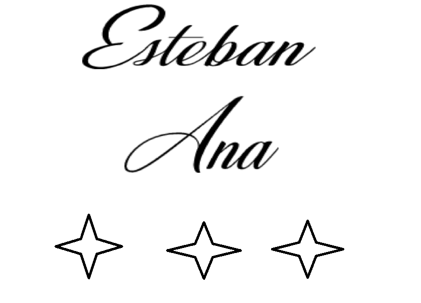
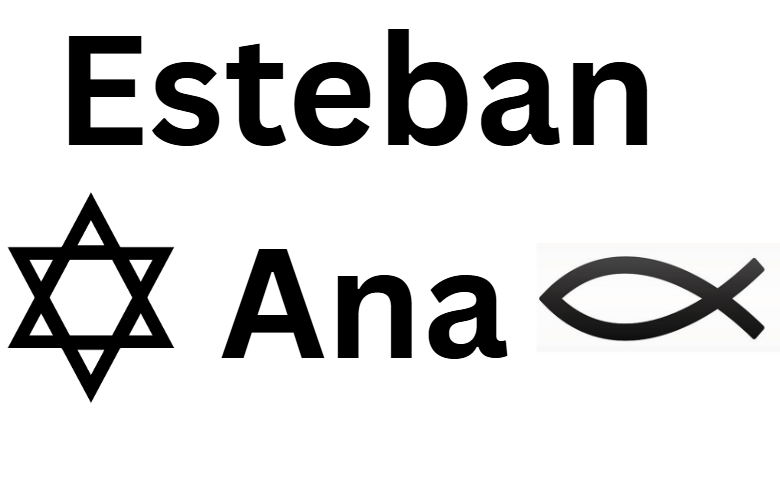
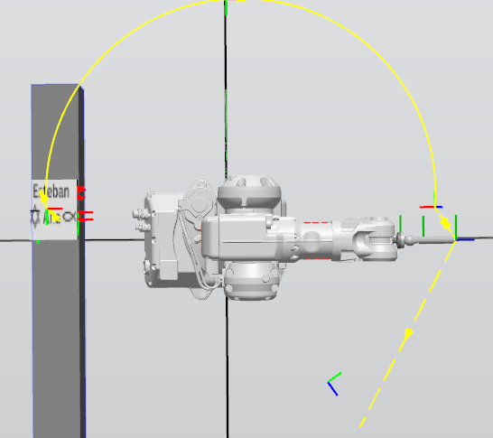

# Informe Laboratorio 1 Robótica Industrial - Trayectorias, Entradas y Salidas Digitales

### Autores:  
Esteban Durán Jiménez  
Ana María Orozco Reyes  

**FACULTAD DE INGENIERÍA**  
**ROBÓTICA**  
**2025-II**

---

## 1. Descripción detallada de la solución planteada

### Planteamiento introductorio:
La tarea principal consistió en programar el robot ABB para realizar la decoración de un pastel.  
Para la simulación, se utilizó una caja que representó una torta para 20 personas. Además de las trayectorias de decorado, fue necesario controlar una banda transportadora y programar dos rutinas distintas: una para ejecutar el proceso de decorado y otra para llevar el robot a una posición de mantenimiento, ambas activadas mediante entradas digitales.  

Como primer paso se definió el diseño que se quería plasmar en la torta. Este diseño se obtuvo a partir de una imagen de referencia, la cual fue utilizada como plantilla dentro de RobotStudio para guiar las trayectorias, a continuacion se pueden ver los tres diseños planteados:

  

Mas adelante se discutira que diseño se selecciono y porque.

---

### Diseño de la herramienta:
Se diseñó una herramienta que sirviera como soporte para un marcador, con el cual se simularían las trayectorias de decorado. Para su construcción se consideró un ángulo de 30 cm entre la punta de la herramienta y el plano formado por los ejes X e Y. También se aseguró que pudiera acoplarse al flanche del robot mediante tornillos, y que el compartimento del marcador contara con espacio suficiente para un resorte de tolerancia.  
El sistema de cierre del compartiment del marcador se diseñó con muescas y salientes en lugar de rosca, lo que facilitó tanto la impresión como el uso de la herramienta, a continuacion se puede ver el diseño inicial y final de la herramienta 

 

En secciones posteriores se explica mas detalladamente el diseño de cada herramienta y porque se requirio un rediseño de la herramienta original.

Posterior al diseño, la herramienta fue probada en RobotStudio junto con el marcador, y se procedió a definir su TCP (Tool Center Point). Este paso fue fundamental para garantizar que los movimientos del robot correspondieran con precisión a la punta de la herramienta.  

Finalmente, la herramienta se calibró físicamente en el robot. Para ello, se emplearon los procedimientos de calibración disponibles en RobotStudio y en el robot real, ajustando el TCP mediante la técnica de los cuatro puntos (tres para orientación y uno para posición) , tambien se tuvo en cuenta el peso de la herramienta. Esto permitió una correcta referencia entre la simulación y la práctica real, a continuacion se pueden observar algunas imagenes de este proceso.

   

---

### Trayectorias en RobotStudio:
El primer paso para realizar las trayectorias fue identificar la ubicacion del robot ABB... y la banda transportadora, tambien se difinio el recorrido de la caja sobre la banda teniendo en cuenta el puntio inicial, punto de decorado y puntwo final, a continuaicon se puede ver un plano de la ubicacion de cada elemento y del recorrido de la caja.

Posteriormente se definio el HOME del robot de tal forma que todas las articulaciones del mismo se encontraran en cero, a partir de este home se defieron dos trayectorias, la primera para realizar el acercamiento a la caja para el decorado y la sengunda para alcanzar el punto de mantenimiento, estas dos trayectorias se pueden ver acontinuación: 

---

### Programación en RAPID
*(Contenido a completar)*  

---

### Configuración de simulación
*(Contenido a completar)*  

---

### Pruebas con el robot físico
*(Contenido a completar)*  

---

## 2. Diagrama de flujo de acciones del robot

---

## 3. Plano de planta de la ubicación de cada uno de los elementos

---

## 4. Descripción de las funciones utilizadas

---

## 5. Diseño de la herramienta detallado

Posteriormente, se realizó la impresión 3D de la herramienta, cuidando parámetros como la resistencia mecánica, el espesor de las paredes y la orientación de las capas de impresión, de modo que soportara adecuadamente las cargas y vibraciones durante las pruebas.  

