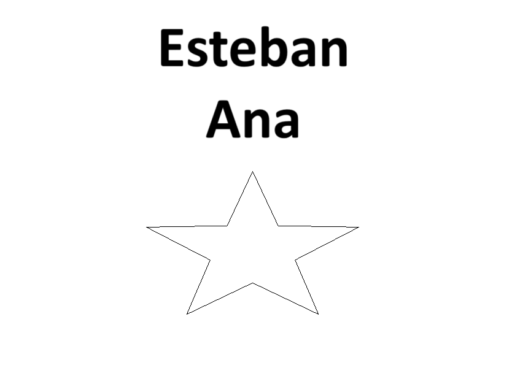

# Informe Laboratorio 1 Robótica Industrial - Trayectorias, Entradas y Salidas Digitales

### Autores:  
Esteban Durán Jiménez  
Ana María Orozco Reyes  

**FACULTAD DE INGENIERÍA**  
**ROBÓTICA**  
**2025-II**

---

## 1. Descripción detallada de la solución planteada

### Planteamiento introductorio:
La tarea principal consistió en programar el robot ABB para realizar la decoración de un pastel.  
Para la simulación, se utilizó una caja que representó una torta para 20 personas. Además de las trayectorias de decorado, fue necesario controlar una banda transportadora y programar dos rutinas distintas: una para ejecutar el proceso de decorado y otra para llevar el robot a una posición de mantenimiento, ambas activadas mediante entradas digitales.  

Como primer paso se definió el diseño que se quería plasmar en la torta. Este diseño se obtuvo a partir de una imagen de referencia, la cual fue utilizada como plantilla dentro de RobotStudio para guiar las trayectorias, a continuacion se pueden ver los tres diseños planteados:

  

Mas adelante se discutira que diseño se selecciono y porque.

---

### Diseño de la herramienta:
Se diseñó una herramienta que sirviera como soporte para un marcador, con el cual se simularían las trayectorias de decorado. Para su construcción se consideró un ángulo de 30 cm entre la punta de la herramienta y el plano formado por los ejes X e Y. También se aseguró que pudiera acoplarse al flanche del robot mediante tornillos, y que el compartimento del marcador contara con espacio suficiente para un resorte de tolerancia.  
El sistema de cierre del compartiment del marcador se diseñó con muescas y salientes en lugar de rosca, lo que facilitó tanto la impresión como el uso de la herramienta, a continuacion se puede ver el diseño inicial y final de la herramienta 

 

En secciones posteriores se explica mas detalladamente el diseño de cada herramienta y porque se requirio un rediseño de la herramienta original.

Posterior al diseño, la herramienta fue probada en RobotStudio junto con el marcador, y se procedió a definir su TCP (Tool Center Point). Este paso fue fundamental para garantizar que los movimientos del robot correspondieran con precisión a la punta de la herramienta.  

Finalmente, la herramienta se calibró físicamente en el robot. Para ello, se emplearon los procedimientos de calibración disponibles en RobotStudio y en el robot real, ajustando el TCP mediante la técnica de los cuatro puntos (tres para orientación y uno para posición) , tambien se tuvo en cuenta el peso de la herramienta. Esto permitió una correcta referencia entre la simulación y la práctica real, a continuacion se pueden observar algunas imagenes de este proceso.

   

---

### Trayectorias en RobotStudio:
El primer paso para realizar las trayectorias fue identificar la ubicacion del robot ABB y la banda transportadora, tambien se difinio el recorrido de la caja sobre la banda teniendo en cuenta el puntio inicial, punto de decorado y puntwo final, en secciones posteriores se puede ver un plano de la ubicacion de cada elemento.

Posteriormente se definio el HOME del robot de tal forma que todas las articulaciones del mismo se encontraran en cero, a partir de este home se defieron dos trayectorias, la primera para realizar el acercamiento a la caja para el decorado y la sengunda para alcanzar el punto de mantenimiento, estas dos trayectorias se pueden ver acontinuación: 

La trayectoria de aproximacion a la pieza se realizo de forma circular con tres puntos utilizando el comando de MoveC y la trayectoria al punto de mantenimiento se realizo de forma lineal con el comando de MoveJ, posteriormente utilizando la la plantilla obtenida con el diseño a plasmar se definieron target punto a punto para luego utilizar la opción de añadir nueva trayectoria se obtenia la trayectoria del decorado, en este punto se tuvieron dificultades con los dos primeros diseños, en el primer caso por el tipo de tipografia escogido que producia trayectorias con curvas dificiles de realizar para el robot y en el segundo caso por el tamaño reducido de las letras, por es finalmente se obtuvo el ultimo diseño con un tamaño de letra mayor y con una tipografia mas sencilla, a continuación se puede observar la trayectoria final obtenida por este medio:

Finalmente utilizando los mismos Target definidoss para la trayectoria de acercamiento a la pieza se realizo la trayectoria de retorno a home y se confirmo con con el teach pendant que en este punto todas las articulaciones estaban en cero como se habia defninido en el codigo de Rappid: 

---

### Programación en RAPID

Inicialmente en el codigo de RAPPID se importan todos los target y path realizados graficamente con la opcion de sincronizar con RAPPID, esto incluye todos los target menos el HOME del robot y la que posicion de mantenimiento que se definieron utilizando la funcion de (`jointtarget();`), en el caso del HOME para asegurar que todas las articulaciones esten en cero y en el caso del punto de mantenimiento para evitar posibles singularidades a continuacion se muestra como se definene estos dos puntos:

(`CONST jointtarget HOME_Origen:=[[0,0,0,0,0,0],[9E+09,9E+09,9E+09,9E+09,9E+09,9E+09]];`)
 
(`CONST jointtarget m:=[[-55,0,0,0,0,0],[9E+09,9E+09,9E+09,9E+09,9E+09,9E+09]];`)

el resto de Target se difinen con la funcion (`robtarget();`) como se puede obsevar a continuación:

(`CONST robtarget Target_10:=[[650.801,731.736,-580],[0,0,0,1],[0,0,0,0],[9E+09,9E+09,9E+09,9E+09,9E+09,9E+09]]:`)

La calibración en RobotStudio fue seleccionada en lugar de una calibración manual debido a que proporciono una mayor precisión debido a la inexperiencia de los operarios lo que tuvo como resultado un error de 20 mm en la calibracon manual, lo que esta muy por encima de lo requerido segun la tolerancia de la herramienta, la calibración  en RobotStudio aprovecha los modelos CAD y la definición exacta de geometrías para calcular el TCP y el *workobject*. Esta decisión permitió garantizar que los movimientos simulados se trasladaran con fidelidad al robot real, reduciendo los ajustes adicionales necesarios en la implementación práctica. La selección de esta calibración se evidencia directamente en las siguientes líneas de código:  

(`PERS tooldata MyNewTool:=[TRUE,[[38.857,0.039,170.7],[0.953716951,0,0.3007058,0]],[0.1,[0,0,1],[1,0,0,0],0,0,0]];`)
(`TASK PERS wobjdata Workobject_1:=[FALSE,TRUE,"",[[0,100,0],[1,0,0,0]],[[650,-100,60],[0,0,1,0]]];`)

La lógica de programación se estructura a partir de un ciclo infinito (`WHILE TRUE DO`), que habilita la operación continua del sistema en función de las señales de entrada digitales (`DI_01` y `DI_02`). El uso de estas entradas permite condicionar el inicio de la secuencia de decoración o el retorno a la posición de mantenimiento según las necesidades del proceso. De igual manera, las salidas digitales (`DO_01` y `DO_02`) controlan los actuadores asociados, como la banda transportadora en ambos sentidos (`Conveyor_FWD` y `Conveyor_INV`). Este esquema evidencia una integración eficiente entre la manipulación robótica y los elementos periféricos del sistema.  

Finalmente, la secuencia de movimientos programada recurre a la ejecución de trayectorias predefinidas (`Path_10`, `Path_20`, etc.), que representan segmentos del diseño decorativo aplicado sobre la torta. Cada trayecto está vinculado a la herramienta y al *workobject* previamente calibrados, asegurando una correcta correspondencia espacial. Además, se implementaron rutinas de espera controladas (`WaitTime` y `WaitUntil`) que sincronizan las acciones del robot con la banda transportadora y las condiciones de entrada. En conjunto, el programa constituye una solución integral que combina control de trayectorias, gestión de periféricos y estrategias de sincronización, consolidando un proceso automatizado robusto y adaptable a diferentes escenarios de producción.  

---

### Configuración de simulación
*(Contenido a completar)*  

---

### Pruebas con el robot físico
*(Contenido a completar)*  

---

## 2. Diagrama de flujo de acciones del robot

El diagrama de flujo describe el comportamiento del robot según las señales de entrada digitales. Si `DI_01 = 1` y `DI_02 = 0`, el robot se mueve a la posición de decoración (Path_10), realiza la decoración del pastel (Path_20 y Path_50 – Path_180) y luego regresa a la posición HOME (Path_30 y Path_40), finalizando el ciclo. En cambio, si `DI_01 = 0` y `DI_02 = 1`, el robot se dirige a la posición de mantenimiento, donde permanece en un bucle de verificación: si `DI_01` y `DI_02` siguen en 0, continúa en mantenimiento, pero cuando cambian a 1, el robot sale del bucle y regresa a HOME, terminando el proceso.

---

## 3. Plano de planta de la ubicación de cada uno de los elementos

  
   
  <em>Plano vista superior</em>

 En el plano anterior se muestra la ubicación de los elementos y las posiciones que toma el pastel durante el proceso, yendo de la 1 a la 2 para la decoración y al haber finalizado esta, se dezplaza a la posición 3.

  
   
  <em>Plano vista lateral</em>

---

## 4. Descripción de las funciones utilizadas

---

## 5. Diseño de la herramienta detallado

Posteriormente, se realizó la impresión 3D de la herramienta, cuidando parámetros como la resistencia mecánica, el espesor de las paredes y la orientación de las capas de impresión, de modo que soportara adecuadamente las cargas y vibraciones durante las pruebas.  

